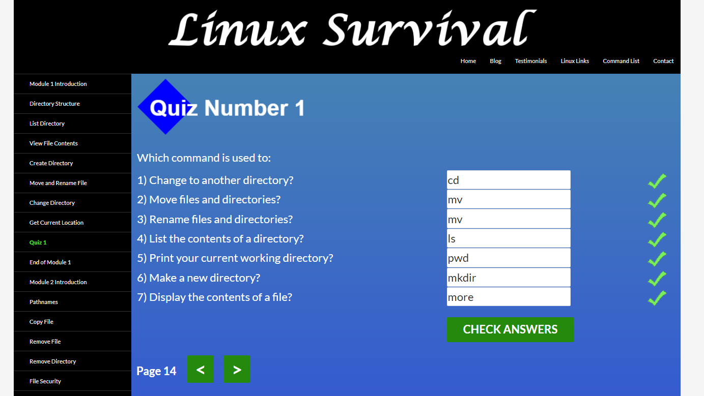
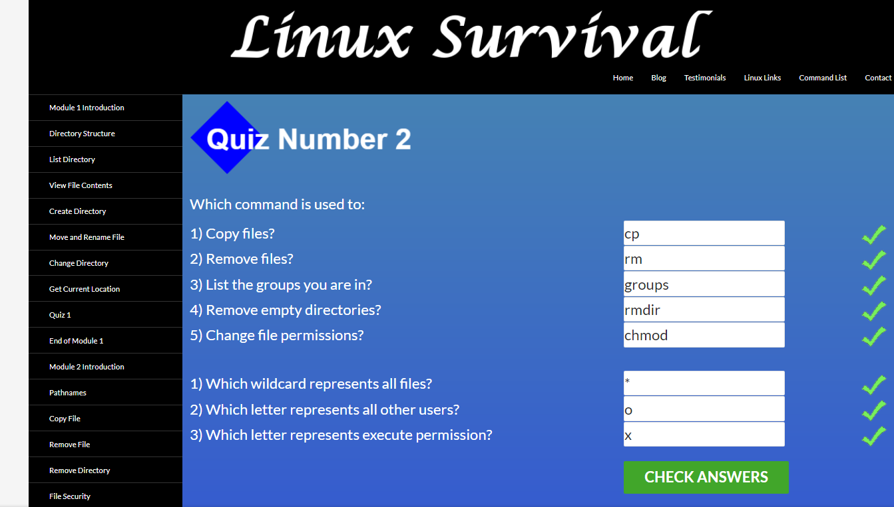
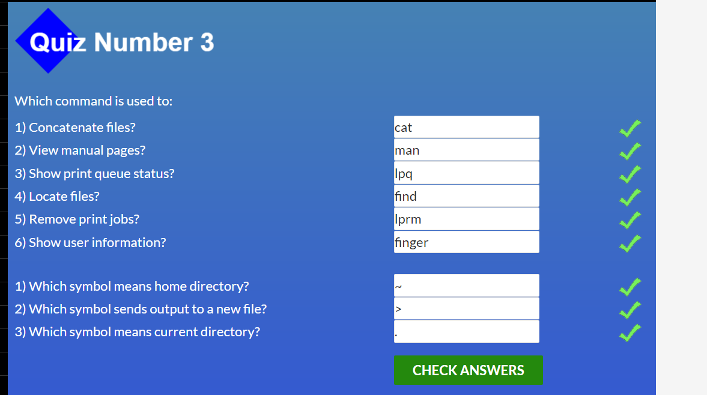
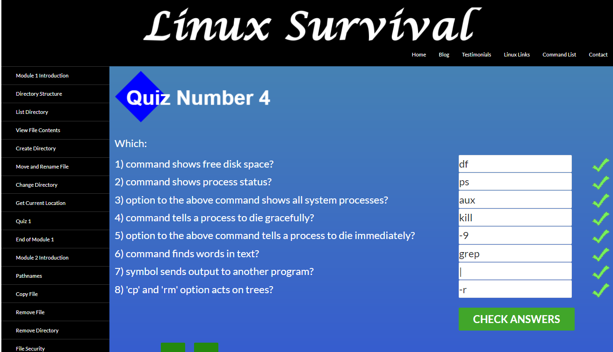

Linux - чомусь від однієї лише назви мені було моторошно. ТАк, я ще з часів динозаврів, коли комп'ютери були величехними спочатку, а потім дуже голосними і неповороткими машинамию
Я починала працювати навіть без мишки :smile: 
Дивно подумати, що працювали лише завдяки скороченням клавіш. Нічого складнішого за друг на клавіатурі не було ))) 
Напевно відтоді у мене залишився той острах перед синім екраном та програмою Total Commander :rofl:
Виконуючи тренажерчик-завдання по Linux я побачила єдину фразу, яка мене дуже підтримала 
> it wasn't even very painful

І на цьому мої страждання закінчились і з'явився азарт. 
До того ж, викдення матеріалу не видається таким сухим, як у курсі про git з Coursera 

Я дуже докладно конспектую, з поясненнями всі команди - це допопмагає за всіма правилами навчання. Якщо виходить помилка - перезавантажую сторінку і пишу правильно. 
 

Звісно, що не скидаю з разівниці той факт, що ще повертатимусь до цього тренажерчика не раз.
Але сьогодні вже написала відверто своїй **buddy** 
 - 

**Про  HTTP та HTTPS**
Настправді про ці види протоколів я більше знаю на прикладному рівні. 
Другий - має виші безпекові показники, якщо на сайті потрібно розміщувати товари для покупки.
>**Що нового**
1. HTTP означає Hypertext Transfer Protocol *протокол прикладного рівня для "переговорів"*, використовує порт 80 протоколу TCP
2. URL-адреса *Uniform Resource Locator* – уніфікований покажчик [місцезнаходження інформаційного] ресурсу
3. HTTP Secure - *протокол захищеного передавання гіпертексту*, використовує порт 443 протоколу TCP