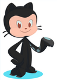

# Kottans-frontend-08-2022

workflow for course :writing_hand: - [Git-dairy on Ukrainian](./dairy-task/)
  Instagram-dairy in [English/Polish/Urkainian](https://www.instagram.com/tina.bond_your_admin/) 

> :writing_hand::writing_hand::writing_hand:

Program 

Stage 0. Self-Study

1. [Git Basics](./git-basics/)
2. [Linux CLI and Networking](/Linux_CLIandHTTP/)
3. [VCS (hello gitty), GitHub and Collaboration](./GitHub%20and%20Collaboration/)
4. Front-End Basics
5. Intro to HTML & CSS
6. Responsive Web Design
7. HTML & CSS Practice
8. JavaScript Basics
9. Document Object Model - practice
10. Advanced Topics
11. Building a Tiny JS World (pre-OOP) - practice
12. Object oriented JS - practice
13. OOP exercise - practice
14. Offline Web Applications - optional
15. Memory pair game — real project!
16. Website Performance Optimization - optional
17. Friends App - real project!

Dedline for Stage 0 - 2022/10/01

- [ ] Wiat, when all tasks are complete :tada:

